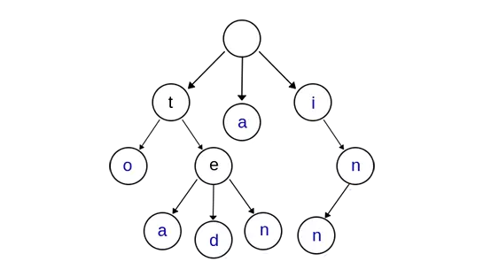
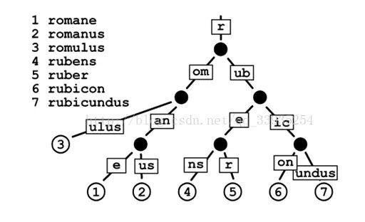
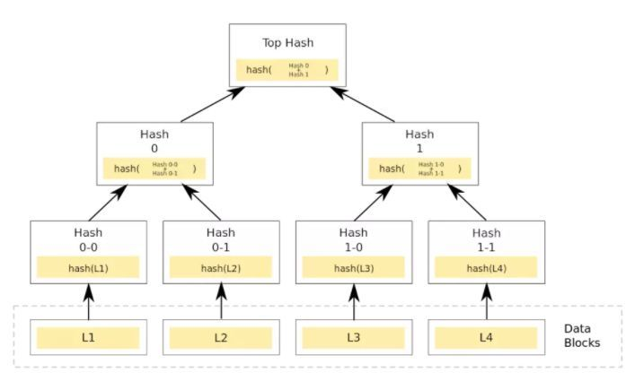
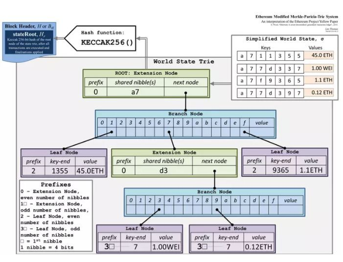

# Project22: research report on MPT

MPT (Merkle Patricia Tries) 是以太坊存储数据的核心数据结构，它是由 Merkle Tree 和 Patricia Tree 结合的一种树形结构，理解 MPT 有助于我们更好的理解以太坊的数据存储。

在了解 MPT 数据结构之前，需要先介绍基本的 Tree 结构和 Merkle Tree、Patricia Tree。

## Trie

Trie 树，又称前缀树或字典树，是一种有序树，用于保存关联数组，其中的键通常是字符串。一个节点的所有子孙都有相同的前缀，也就是这个节点对应的字符串，而根节点对应空字符串。Trie的核心思想就是用空间换时间，利用公共前缀缩小要比较的范围来达到快速查找的目的。

相比于哈希表，使用前缀树来进行查询拥有共同前缀key的数据时十分高效，例如在字典中查找前缀为pre的单词，对于哈希表来说，需要遍历整个表，时间效率为O(n)，然而对于前缀树来说，只需要在树中找到前缀为pre的节点，且遍历以这个节点为根节点的子树即可。

但是对于最差的情况（前缀为空串)，时间效率为O(n),仍然需要遍历整棵树，此时效率与哈希表相同。

相比于哈希表，在前缀树不会存在哈希冲突的问题。

上图是一棵 Trie 树，表示了字符串集合{“a”, “to”, “tea”, “ted”, “ten”, “i”, “in”, “inn”} ，从上图中我们可以看出Trie树的特点：

- 根节点不包含字符，除根节点外的每一个子节点都包含一个字符。
- 从根节点到某一个节点，路径上经过的字符连接起来，为该节点对应的字符串。
- 每个节点的所有子节点包含的字符互不相同。

然而，这样的结构存在缺陷。当存在少量的长字符串，且其某个较长前缀下只有本身一个元素时，树的高度会很大，且一条长路径上只有一个叶节点。这样极大地浪费了存储空间，且应用起来效率也不高。下图展示了这样的状态：

为了解决这个问题，产生了Patricia 树 (压缩前缀树)。

## Patricia Trie

压缩前缀树，是一种更节省空间的 Trie。对于树的每个节点，如果该节点是唯一的子节点，就和父节点合并。

## Merkle Tree

Merkle树，主要用于数据集较大时的文件校验。其主要特点为：

- 叶节点存储数据块的 Hash（如：文件块、一段数据集）
- 非叶子节点 (包括中间节点和根节点) 存储着对应子节点 Hash 值串联字符串之后的 Hash 值。

从上图中可以看出：

- 在最底层，和哈希列表一样，我们把数据分成小的数据块，有相应地哈希和它对应；
- 往上走，并不是直接去运算根哈希，而是把相邻的两个哈希合并成一个字符串，然后运算这个字符串的哈希。
- 最终到达根节点，生成了可以代表整棵树的hash值，该节点成为叫做 Merkle Root。

该数据结构的应用可以通过一个实例理解。

在 P2P 下载中，文件会切分成很多小的数据块，每个数据块从不同的来源上下载，这些来源可能是不稳定或不可信的。文件下载完成后，需要校验文件完整性。

以往一般的做法是对于整个文件计算hash值并与正确的值进行对比。然而这需要完整地下载整个文件，并且一旦产生错误，也很难找出是哪一个部分出现问题，这使得下载的可靠性和效率都很差。而Merkle Tree就可以解决这个问题。

在P2P网络下传输文件之前，先从可信的源获得文件的Merkle Root，然后就可以从其他不可信的源获取Merkle tree。通过可信的Merkle Root来验证Merkle tree是否损坏或者是虚假的。文件合并之后，计算小数据块的 Hash 并最终计算根 Hash，对比与可信的根 Hash 是否一致。这样就避免了对整个文件进行 Hash 计算。

------

了解了这些基本概念，下面可以开始讨论报告的主题：MPT。

MPT，即Merkle Patricia Tree。是一种经过改良的、融合了默克尔树和前缀树两种树结构优点的数据结构，是以太坊中用来组织管理账户数据、生成交易集合哈希的重要数据结构。

MPT树有以下几个作用：

- 存储任意长度的key-value键值对数据，符合以太坊的state模型；
- 提供了一种快速计算所维护数据集哈希标识的机制；
- 提供了快速状态回滚的机制；
- 提供了默克尔证明，进行轻节点的扩展，实现简单支付验证；

MPT树中的节点包括空节点、叶子节点、扩展结点和分支节点。

1、空节点（NULL）：表示为空，在代码中是一个空串。

2、叶子节点（leaf）：表示为 [key,value]的一个键值对，其中key是key的一种特殊十六进制编码(MP编码)， value是value的RLP编码。

3、拓展节点（extension）：也是[key,value],但是这里的value是其他节点的hash，通过这个hash链接到其他节点。

4、分支节点（branch）：MPT中的key被序列化成一种特殊的16进制编码，加上最后的value，所以分支节点是一个长度为17的list，前16个元素对应着key中的16个可能的十六进制字符。如果有一个[key,value]对在这个分支节点终止，则最后一个元素代表一个值（例如，有三个key，分别是（abc，abd，ab），则该节点的第17个字段存储了ab节点的值）即分支节点既可以是搜索路径的终止也可以是路径的中间节点。对应于Trie中的关键路径节点。

MPT中另外一个重要的概念是一个特殊的十六进制前缀(hex-prefix, HP)编码，用来对key进行编码。这种编码使用十六进制字符串，因此前缀的字母表也是16进制，每个节点可能有16个子节点。

**HEX-Prefix 十六进制前缀编码**：

- 若输入key结尾为0x10，则去掉这个终止符。
- key之前填充一个二进制四元组，第0位区分奇偶信息，第1位区分节点类型。
- 如果输入key的长度是偶数，则再添加一个四元组0x0在flag四元组后。
- 将原来的key内容压缩，将分离的两个hex以高四位低四位进行合并成一个字节。

此外，注意到叶节点和扩展节点的存储结构完全相同。为了将 MPT 树存储到数据库中，同时还可以把MPT树从数据库中恢复出来，对于 Extension 和 Leaf 的节点类型做了特殊的定义：**如果是一个扩展节点，那么前缀为0，这个0加在 key 前面。如果是一个叶子节点，那么前缀就是1**。

## MPT结构

MPT树的特点如下:

- 叶子节点和分支节点可以保存value, 扩展节点保存key；
- 没有公共的key就成为2个叶子节点；key1=[1,2,3] key2=[2,2,3]
- 有公共的key需要提取为一个扩展节点；key1=[1,2,3] key2=[1,3,3] => ex-node=[1],下一级分支node的key
- 如果公共的key也是一个完整的key，数据保存到下一级的分支节点中；key1=[1,2] key2=[1,2,3] =>ex-node=[1,2],下一级分支node的key; 下一级分支=[3],上一级key对应的value

使用MPT的主要原因在于一个问题：设计在扩展节点的Val字段有可能存储一串哈希值作为孩子节点的索引，这一点符合Trie的特性。

在以太坊中，该哈希代表着另外一个节点在数据库中索引，即根据这个哈希值作为数据库中的索引，可以从数据库中读取出另外一个节点的内容。

这种设计的目的是：

（1）当整棵树被持久化到数据库中时，保持节点间的关联关系；

（2）从数据库中读取节点时，尽量避免不必要的IO开销；

在内存中，父节点与子节点之间关联关系可以通过引用、指针等编程手段实现，但是当树节点持久化到数据库是，父节点中会存储一个子节点在数据库中的索引值，以此保持关联关系。

同样，从数据库中读取节点时，本着最小IO开销的原则，仅需要读取那些需要用到的节点数据即可，因此若目前该节点已经包含所需要查找的信息时，便无须将其子节点再读取出来；反之，则根据子节点的哈希索引递归读取子节点，直至读取到所需要的信息。

## 节点分类
MPT树中，树节点可以分为以下几类：空节点、分支节点、叶子节点、扩展节点

### 空节点
空节点用来表示空串。

### 分支节点

分支节点用来表示MPT树中所有拥有超过1个孩子节点以上的非叶子节点

与前缀树相同，MPT同样是把key-value数据项的key编码在树的路径中，但是key的每一个字节值的范围太大（[0-127]），因此在以太坊中，在进行树操作之前，首先会进行一个key编码的转换，将一个字节的高低四位内容分拆成两个字节存储。通过编码转换，key’的每一位的值范围都在[0, 15]内。因此，一个分支节点的孩子至多只有16个。以太坊通过这种方式，减小了每个分支节点的容量，但是在一定程度上增加了树高。

分支节点的孩子列表中，最后一个元素是用来存储自身的内容。

此外，每个分支节点会有一个附带的字段nodeFlag，记录了一些辅助数据：

（1）节点哈希：若该字段不为空，则当需要进行哈希计算时，可以跳过计算过程而直接使用上次计算的结果（当节点变脏时，该字段被置空）；

（2）脏标志：当一个节点被修改时，该标志位被置为1；

（3）诞生标志：当该节点第一次被载入内存中（或被修改时），会被赋予一个计数值作为诞生标志，该标志会被作为节点驱除的依据，清除内存中“太老”的未被修改的节点，防止占用的内存空间过多。

### 叶子节点&&扩展节点

关键的字段为：

（1）Key：用来存储属于该节点范围的key，这是MPT树实现树高压缩的关键；

（2）Val：用来存储该节点的内容；

如之前所提及的，前缀树中会出现严重的存储空间浪费的情况，如下图：

针对这种情况，MPT树对此进行了优化：当MPT试图插入一个节点，插入过程中发现目前没有与该节点Key拥有相同前缀的路径。此时MPT把剩余的Key存储在叶子／扩展节点的Key字段中，充当一个”Shortcut“。

例如图中我们将红线所圈的节点称为node1, 将紫色线所圈的节点称为node2。node1与node2共享路径前缀t，但是node1在插入时，树中没有与oast有共同前缀的路径，因此node1的key为oast，实现了编码路径的压缩。

这种做法可以提高节点的查找效率，避免过多的磁盘访问，并且减少存储空间浪费，避免存储无用的节点。

## 安全的MPT
以上介绍的MPT树，可以用来存储内容为任何长度的key-value数据项。倘若数据项的key长度没有限制时，当树中维护的数据量较大时，仍然会造成整棵树的深度变得越来越深，会造成以下影响：

（1）查询一个节点可能会需要许多次IO读取，效率低下；

（2）系统易遭受Dos攻击，攻击者可以通过在合约中存储特定的数据，“构造”一棵拥有一条很长路径的树，然后不断地调用SLOAD指令读取该树节点的内容，造成系统执行效率极度下降；

（3）所有的key其实是一种明文的形式进行存储。

为了解决以上问题，在以太坊中对MPT再进行了一次封装，对数据项的key进行了一次哈希计算，因此最终作为参数传入到MPT接口的数据项其实是(sha3(key), value)

__优势__

1、传入MPT接口的key是固定长度的（32字节），可以避免出现树中出现长度很长的路径；

__劣势__

1、每次树操作需要增加一次哈希计算；

2、需要在数据库中存储额外的sha3(key)与key之间的对应关系。

## 总结

MPT结合了Merkle Tree和Patricia Trie的优势，概括如下：

可以实现快速重哈希，当树节点内容发生变化时，能够在前一次哈希计算的基础上，仅仅将被修改的树节点进行哈希重计算，便能得到一个新的根哈希用来代表整棵树的状态。

仍然可以进行轻节点扩展，验证一条交易只需要验证包含该交易的路径即可，并不需要把所有交易的Hash全部重新算一遍。

能够实现快速状态回滚。区块链公链的环境下，可能会造成分叉而导致区块链状态需要进行回滚，由于出块时间短，这种分叉的几率很大，区块链状态回滚的现象很频繁。所谓的状态回滚指的是：（1）区块链内容发生了重组织，链头发生切换（2）区块链的世界状态（账户信息）需要进行回滚，即对之前的操作进行撤销。

每个节点在数据库中的存储都是值驱动的。当一个节点的内容发生了变化，其哈希相应改变，而MPT将哈希作为数据库中的索引，也就实现了对于每一个值，在数据库中都有一条确定的记录。而MPT是根据节点哈希来关联父子节点的，因此每当一个节点的内容发生变化，最终对于父节点来说，改变的只是一个哈希索引值；父节点的内容也由此改变，产生了一个新的父节点，递归地将这种影响传递到根节点。最终，一次改变对应创建了一条从被改节点到根节点的新路径，而旧节点依然可以根据旧根节点通过旧路径访问得到。所以，在以太坊中，发生分叉而进行世界状态回滚时，只需要用旧的MPT根节点作为入口，就能完成一次“状态回滚”。
